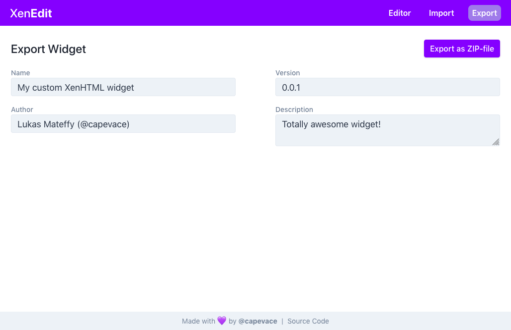
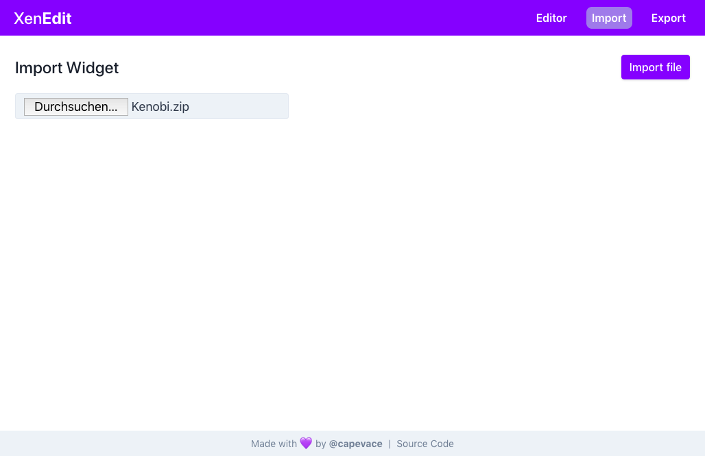

<div align="center">
	<a href="https://mateffy.me/xenedit">
		
	</a>
	<h1>XenEdit</h1>
	<p>
		Simple XenHTML widget editor with live preview!
	</p>
	<p>
		<a href="https://mateffy.me/xenedit">Live Demo</a>
	</p>
</div>

<br>

## Features

-   Write HTML, CSS and JavaScript right in the browser
-   Live-preview for fast progress
-   Import and Export widgets as ZIP files

## Planned Features

-   Custom file support (be able to create custom files, e.g. images)
-   Settings (be able to specify placeholders that the user will be able to change)

## Screenshots

<p align="center">
  
</p>
<p align="center">
  
</p>
<p align="center">
  
</p>

## Project setup

```
npm install
```

### Compiles and hot-reloads for development

```
npm run serve
```

### Compiles and minifies for production

```
npm run build
```

### Lints and fixes files

```
npm run lint
```
